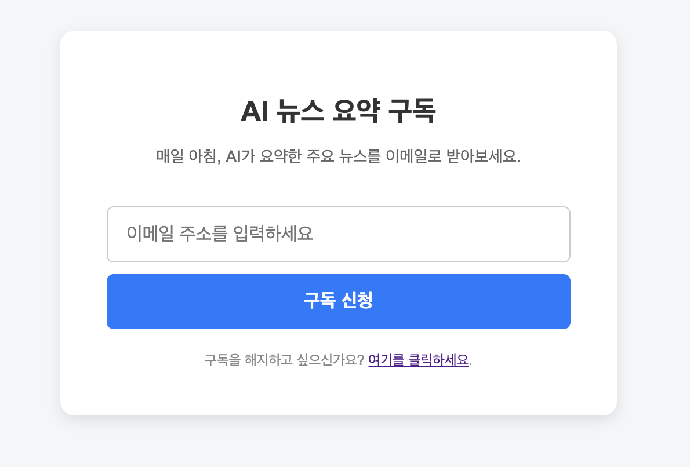
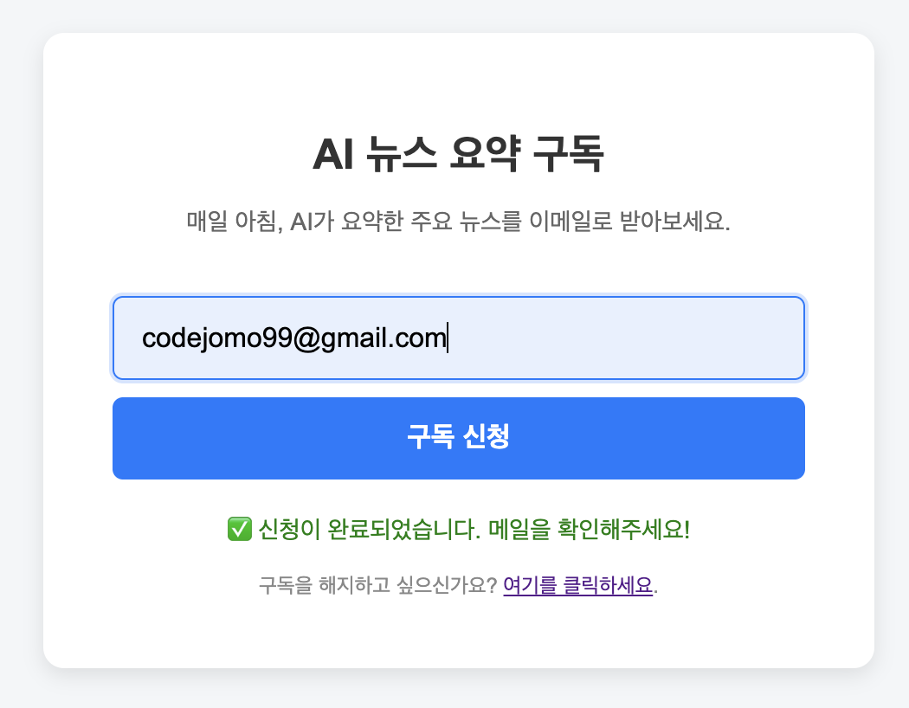
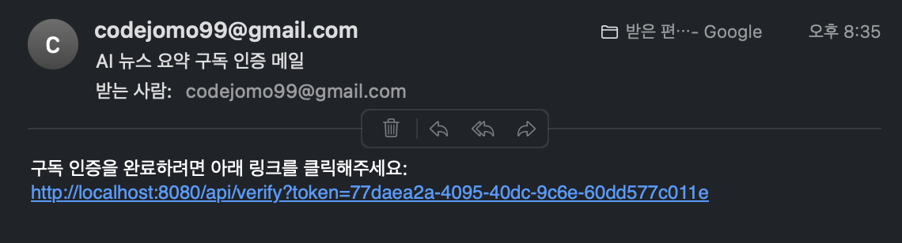
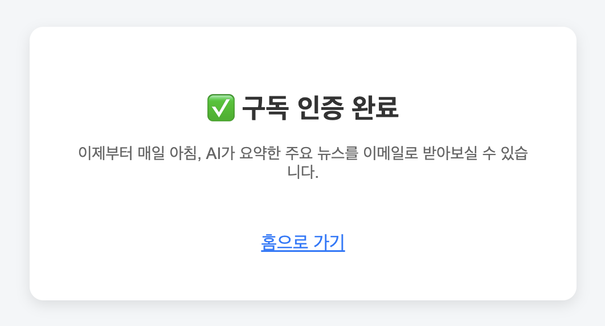
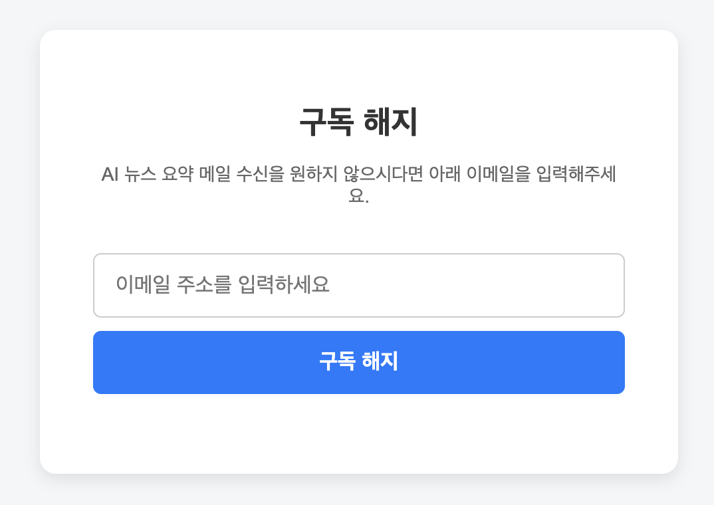
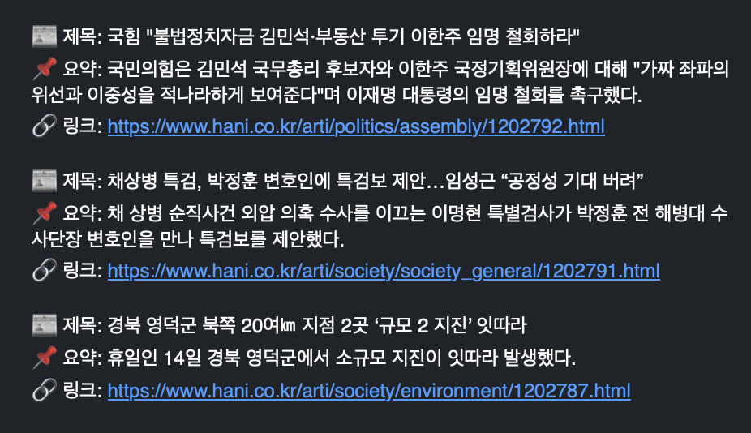

# 📰 AI 뉴스 요약 메일링 서비스

> 사용자가 이메일만 입력하면, 매일 아침 국내 주요 언론사의 뉴스를 AI가 자동으로 요약하여 전달해주는 완전 자동화 뉴스 요약 메일링 서비스입니다.


## 📌 프로젝트 개요

**AI 뉴스 요약 메일링 서비스**는 사용자가 이메일을 구독하면, 매일 아침 AI가 최신 뉴스를 요약하여 메일로 발송해주는 백엔드 중심의 프로젝트입니다.

<p align="center">
  
</p>

## 🛠️ 기술 스택

### 🔗 Backend
- **Java 17**, **Spring Boot 3.x**
- **Spring Web**: REST API 구성
- **Spring Scheduled**: 뉴스 수집 및 이메일 발송 자동화 스케줄링
- **Spring Mail**: 이메일 인증 및 요약 메일 발송
- **Spring Data JPA**, **H2 Database**: 구독자 및 요약 데이터 관리

### 📰 AI 요약 & 크롤링
- **Google Gemini API**: 뉴스 본문 기반 요약 생성 
- **JSoup**: 연합뉴스, 중앙일보, 한겨레, 서울신문 등 실시간 뉴스 크롤링

### 🧪 테스트 & 빌드
- **JUnit 5**: 단위 테스트
- **Gradle**: 프로젝트 빌드 및 의존성 관리

### 💻 Frontend
- **HTML5**, **CSS3**, **Vanilla JavaScript**
- 이메일 구독/해지용 간단한 입력 폼 제공


## ✅ 주요 기능

### 1. ✉️ 이메일 구독 & 인증
- 사용자가 이메일을 입력하면 인증 메일 전송
- 링크 클릭 시 인증 완료 → 구독 등록

<p align="center">
  
</p>


<p align="center">
  
</p>

<p align="center">
  
</p>

### 2. ✉️ 이메일 구독 해제 & 인증
- 사용자가 이메일을 입력하면 인증 메일 전송
- 링크 클릭 시 인증 완료 → 구독 해제

<p align="center">
  
</p>

### 3. 📰 뉴스 크롤링 & Gemini AI 요약

- 매일 오전, 아래 주요 언론사들의 실시간 뉴스를 **JSoup**을 활용해 크롤링합니다:
    - 연합뉴스 (https://www.yna.co.kr)
    - 서울신문 (https://www.seoul.co.kr)
    - 중앙일보 (https://www.joongang.co.kr)
    - 한겨레 (https://www.hani.co.kr)

- 각 뉴스는 **제목 / 본문 요약 / 기사 링크**로 구성되며, 최신순 10개 내외 기사를 수집합니다.

🧠 Gemini 요약 전략
- 수집된 뉴스는 AI 요약을 위해 프롬프트로 묶어 Google Gemini API에 전달됩니다.
- Gemini API의 요청 길이 제한을 고려해, 문장 수 제한 / 텍스트 길이 제한 / 프롬프트 분할을 적용합니다.
- AI는 주제별로 유사 기사를 묶고, 총 3개의 대표 뉴스로 요약해줍니다.

### 4. 📬 요약 메일 전송
- 인증된 사용자 목록을 조회
- 저장된 요약 본문을 각 사용자에게 메일로 발송

<p align="center">
  
</p>


## 📊 전체 아키텍처
```
사용자 입력
   │
   ▼
[이메일 인증]
   │
   ▼
[스케줄러]
   │ 08:00
   ▼
[뉴스 크롤링] ──▶ [DB 저장]
   │
   ▼
[Gemini 요약] ──▶ [요약 DB 저장]
   │
   ▼
[사용자 메일 발송]
```

## 📕 개선 기록

- [Gemini AI 기능 개선 (크롤링을 하는 이유)](https://github.com/codejomo99/ai-news/wiki/AI-%EC%9A%94%EC%95%BD-%EA%B8%B0%EB%8A%A5-%EA%B0%9C%EC%84%A0-%EB%82%B4%EC%97%AD-%F0%9F%A7%A0)


## ©️ License

본 프로젝트는 개인 학습 및 사이드 프로젝트 목적으로 개발되었습니다.
